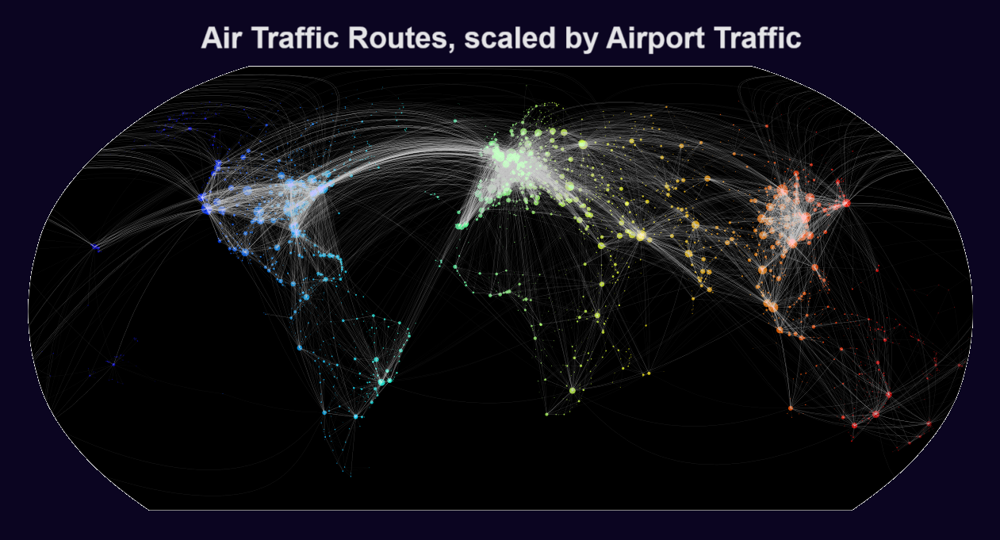

# Works

Hello! Welcome to my collection of fun school assignments and little pet projects.

## cosi149b
This folder contains 3 pytorch/scikit-learn projects from **cosi149b, Machine Learning with Big Data**. This class focused on predictive modeling with CNNs and results-based hyperparameter tuning. These projects are generally intended to be run on Google Colab, and thus have been designed to run properly with only ~9GB available RAM. This folder demonstrates my proficiency with common methods for big data machine learning, as well as my ability to deliver results under processing power constraints.

## geospatials
Data visualization experiments using matplotlib, CartoPy, and NumPy. Here's an example, using raw airport and route spreadsheet data to make a beautiful map of air traffic routes, with airport markers scaled by amount of traffic. 

## zips
Zips is a Python-based chess engine I wrote in high school. It implements a classic [MiniMax](https://en.wikipedia.org/wiki/Minimax) search algorithm with accurate legal move generation and a WIP implementation of the [Universal Chess Interface](https://www.chessprogramming.org/UCI), for seamless assimilation with all chess-related software. Zips demonstrates sleek code and my ability to create interconnected systems, as well as my knowledge of data algorithms.

## agents
Agents is a short Java demonstration of emergent properties. The agents (30000 in the source code file) are given an initial position and acceleration vector, and then are set loose on the screen. There is a slight bit of random movement built in, but otherwise the agents simply follow the trails of other agents. These simple rules give rise to complex lattices of trails as the agents fight to stay in line with each other. This experiment was inspired by [Sebastian Lague's](https://www.youtube.com/c/SebastianLague) work on boids, ants, and slimes.

  

## snake
Snake is simply a recreation of the classic arcade game. I wrote this simplified, pixel-based version of Snake in about 20 minutes in Java during a particularly drawn-out Introduction to Microeconomics lecture.

## sudoku
One of my many hobbies is Sudoku, a grid-based logic puzzle. I wondered if Sudoku boards could be solved using brute force. While there are other ways to solve them using more nuanced methods, it turns out most Sudoku boards can be solved in under 300ms using a brute force approach, implemented here. I would be curious to test the effectiveness and speed of other methods, such as [Exact Cover](https://en.wikipedia.org/wiki/Exact_cover#Sudoku) and [Residuals](https://en.wikipedia.org/wiki/Sudoku_solving_algorithms#Relations_and_residuals).
